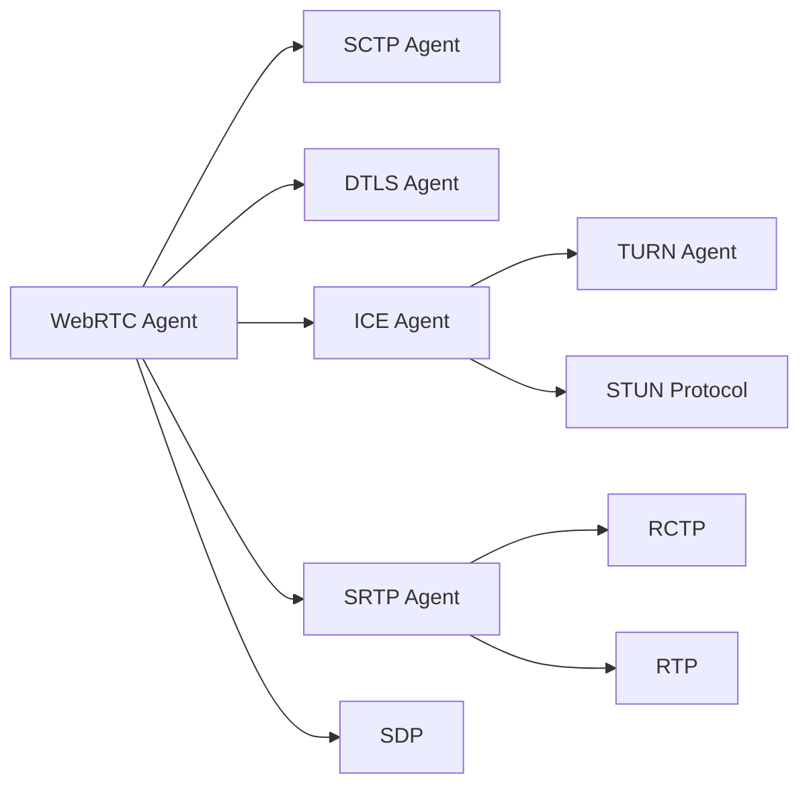

---
# try also 'default' to start simple
theme: seriph
# random image from a curated Unsplash collection by Anthony
# like them? see https://unsplash.com/collections/94734566/slidev
background: https://cover.sli.dev
# some information about your slides, markdown enabled
title: WebRTC-QoE
info: |
  ## Slidev Starter Template
  Presentation slides for developers.

  Learn more at [Sli.dev](https://sli.dev)
# apply any unocss classes to the current slide
class: text-center
# https://sli.dev/custom/highlighters.html
highlighter: shiki
# https://sli.dev/guide/drawing
drawings:
  persist: false
# slide transition: https://sli.dev/guide/animations#slide-transitions
transition: slide-left
# enable MDC Syntax: https://sli.dev/guide/syntax#mdc-syntax
mdc: true
---
# Estimating WebRTC Video QoE Metrics Without Using Application Headers

 

## Taveesh Sharma, Tarun Mangla et.al *IMC 2023*
<!--
The last comment block of each slide will be treated as slide notes. It will be visible and editable in Presenter Mode along with the slide. [Read more in the docs](https://sli.dev/guide/syntax.html#notes)
-->

---
transition: fade-out
layout: two-cols
layoutClass: gap-16
---

# What is WebRTC?

WebRTC, short for Web Real-Time Communication, is both an API and a Protocol.
- **Signaling** 
  - SDP (Session Description Protocol)
- **Connecting** 
  - ICE (Interactive Connectivity Establishment)
- **Securing**
  - DTLS (Datagram Transport Layer Security) 
  - SRTP (Secure Real-Time Transport Protocol)
- **Communicating**
  - RTP (Real-time Transport Protocol)
  - SCTP(Stream Control Transmission Protocol)

::right::

  <a href="https://github.com/webrtc-for-the-curious/webrtc-for-the-curious" target="_blank" alt="GitHub" title="Open in GitHub"
    class="text-xl slidev-icon-btn opacity-50 !border-none !hover:text-white">
    <carbon-logo-github />
  </a>

<!--
You can have `style` tag in markdown to override the style for the current page.
Learn more: https://sli.dev/guide/syntax#embedded-styles
-->

<!--
Here is another comment.
-->

---
transition: slide-up
level: 2
---

# WebRTC based Video Conference Applications (VCAs)

<!--
Here is another comment.
-->

---
transition: slide-left
---

# Motivation
- Quality of Experience (QoE) is critical for VCAs' using
- QoE can be improved by optimizing both the end hosts and the network

How can network operators know about QoE metrices?

  - Existing VCA QoE estimation methods use passive measurements of application-level RTP headers
    - They have no access to end hosts
    - Some apps may use custom RTP protocols → need special methods
    - VPN → encrypted application headers

**GOAL**: Can we use IP/UDP headers to infer QoE?

---
transition: slide-left
layout: two-cols
layoutClass: gap-16
---

# QoE metrices
Focused on video QoE for VCAs
> previous work has already estimated audio QoE for VoIP

- Frame Rate/FPS (Smoothness)

- Bitrate (Data Transfer Rate)

- Frame Jitter (Consistency)

- Resolution (Detail)

::right::
 
 
 

---
transition: fade-out
---
# Method-Step 1
The first step involves isolating the video traffic from the audio component

Three kinds of *payload type*:
- PT = 111: audio encoded using OPUS → \[89, 385\] bytes
- PT = 102: video encoded using H.264 → 99% > 564 bytes
- PT = 103: video retransmissions → 92% 304 bytes: keep-alive messages

> Use a size threshold $V_{min}$ to identify video packets

---
transition: slide-up
---
# Method-Step 2
Identifying the video frame boundaries (by identifying frame end time) without using RTP headers

- **Key Insight 1**: inter-departure time within the frame < inter-departure time across the frame

- Problems:
  - packet timings can change when packets traverse along the network
  - patterns in inter-departure time may not appear in inter-arrival time
  - happens when congestion or packet loss occurs

---
transition: slide-up
---
# Method-Step 2
Identifying the video frame boundaries (by identifying frame end time) without using RTP headers

- **Key Insight 2**: there are unique patterns in packet sizes
  - packet sizes tend to resemble those within the same frame and differ from those in consecutive frames
  - VCAs typically fragment a frame into equal-sized packets
    - Forward Error Correction (FEC) mechanisms
      - bandwidth-efficient when packets in a frame have equal length

---
transition: slide-up
---
# Method-Step 2
Identifying the video frame boundaries (by identifying frame end time) without using RTP headers

- **Frame boundary estimation**: 
  - packet size threshold $\Delta^{max}_{size}$
  - not sufficient to compare only consecutive packets as packets can arrive out of order
    - compare with up to $N^{max}$ packets that arrived before this packet
    - $N^{max}$ should be set carefully

---
transition: fade-out
---
# Heuristic method

---
transition: fade-out
---
# IP/UDP Heuristic Failure Cases
Wrong estimation of frame boundaries

## Three cases

 

---
transition: fade-out
---
# Machine Learning Approach
Dur to incorrect estimation of frame boundaries in Heuristic methods → ML method
## Input features

  - Flow-level statistics (derived from IP/UDP headers)

- VCA semantics-based → IP/UDP ML
  - Number of unique packet sizes
  - Number of microbursts

  - RTP-based features (derived from RTP headers) → RTP ML

- Method: Random Forests

---
transition: fade-out
---
# Experiment Setup And Datasets
VCAs running over WebRTC: Google Meet, Microsoft Teams and Cisco Webex 

### Acquiring ground truth of QoE metrices:
- `webrtc-internals` API provided by Google Chrome

### Network Conditions

---
transition: fade-out
---
# Evaluation-Media Classification Accuracy
The ground truth is obtained by inspecting the `payload type` RTP header

- The accuracy of identifying video packets is generally high
- misclassified packets:
  - server hello messages over DTLSv1.2
  - key exchanges in the beginning of the call

---
transition: slide-up
---
# Evaluation-Frame Rate Estimation Accuracy
The ground truth is provided by `webrtc-internal` API from Google Chrome

- Mean Absolute Error (MAE): RTP ML < IP/UDP ML < RTP Heuristic < IP/UDP Heuristic
- Heuristic higher:
  - false frame boundary estimation → overestimation of number of frames
    - Meet uses V8 or V9 to encode, while others use H.264
      - V8 or V9 encoding causes intra-frame packet size difference > $\Delta^{max}_{size}$
  - additional application-level delay (jitter buffer delay) → ML perform better

---
transition: slide-up
---
# Evaluation-Bitrate Estimation Accuracy
The ground truth is provided by `webrtc-internal` API from Google Chrome

- Both Heuristic methods are relatively high
  - Encrypted encoding application-level overheads → hard to know from IP/UDP level
- Video bitrate is inherently correlated with observed throughput

---
transition: slide-up
---
# Evaluation-Frame Jittor Estimation Accuracy
The ground truth is provided by `webrtc-internal` API from Google Chrome

- Overestimate frame jittor in most cases
  - Jittor buffer introduces variable delay to ensure smooth video playback
  - Jittor over decoding delay

---
transition: slide-up
---
# Evaluation-Resolution Estimation Accuracy
The ground truth is provided by `webrtc-internal` API from Google Chrome
- Use frame height as the measurement for resolution
  - bin the frame height into three classes: *low*($\le$ 240), *medium*(\(240, 480\]), *high*(> 480)

 

 

- 70% of frames in medium class have a frame height of 404, which is close to the threshold 480

---
transition: slide-up
---
# Conditions that IP/UDP ML failed to work

- Observe an increasing trend in errors as network loss increases
  - losses lead to retransmissions for video packets, leading to packet reordering
  - It is not possible to determine the correct order of the packets using only IP/UDP headers

- Similar behaviors lead to packet reordering also cause problems
  - high latency
  - throughput jittor

---
transition: slide-up
---
# Effect of Prediction Window Size

- Estimation errors decrease as the prediction window size increases
- Observe similar patterns across other methods and metrices

---
transition: slide-up
---
# Take Away & Future Work

## Take Away
- IP/UDP heuristic often fails under challenging network conditions
- An untuned ML model that uses a combination of VCA-semantics and IP/UDP based features is enough

## Future Work
- Generalizability to other VCAs
  - The lack of methods to obtain application-level QoE metrices for native VCA client → WebRTC-based
- Application Modalities
  - this work only focus on a two-person call scenario
  - other application modes: disabling video, multi-party conferencing and screen sharing
- Deploy-ability
  - implement these approaches within a real-world network (campus network)

---
layout: center
class: text-center
---

# Thanks for Listening

[Paper](https://dl.acm.org/doi/pdf/10.1145/3618257.3624828) · [GitHub](https://github.com/noise-lab/vcaml) · [Conference video](https://dl.acm.org/doi/10.1145/3618257.3624828)
